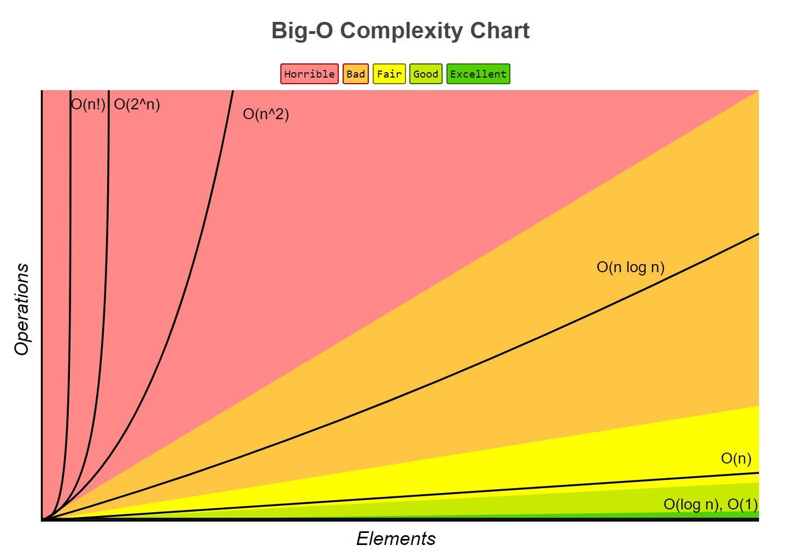
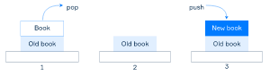
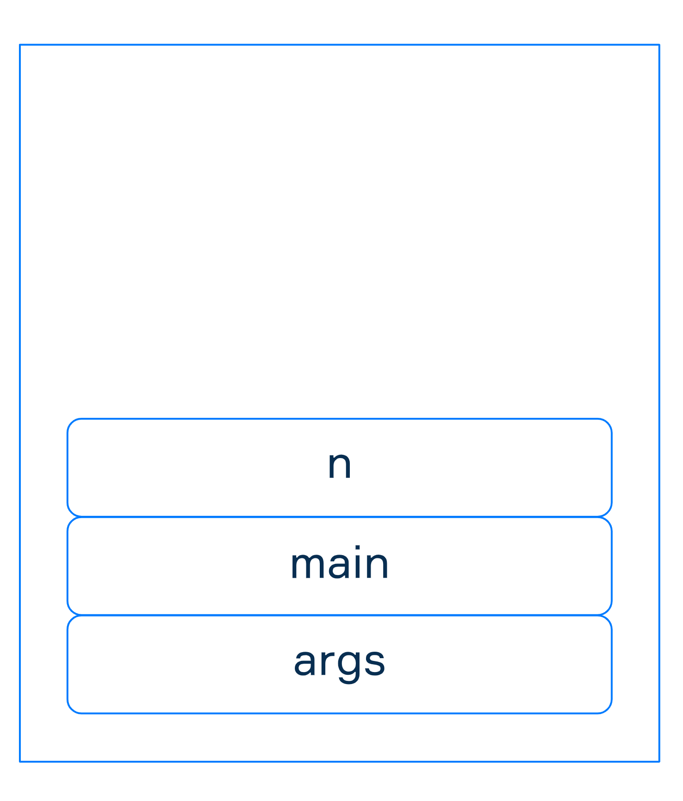
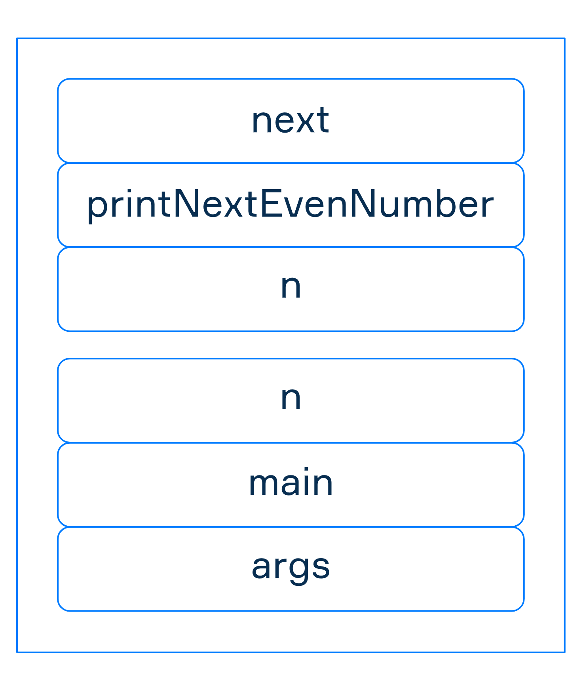

## The Big O Notation 
The Big O Notation is a way to measure an algorithm’s efficiency. It measures the time it takes to run your function as the input grows. Or in other words, how well does the function scale.

Writing Big O Notation
When we write Big O notation, we look for the fastest-growing term as the input gets larger and larger. We can simplify the equation by dropping constants and any non-dominant terms. For example, O(2N) becomes O(N), and O(N² + N + 1000) becomes O(N²).

Binary Search is O(log N) which is less complex than Linear Search. There are many more complex algorithms. A common example of a quadratic algorithm or O(N²) is a nested for loop. In a nested loop, we iterate through the entire data in an outer loop. Then for each element, we iterate through the data in an inner loop. This is N x N times of N²




### Stack essentials
A stack is an abstract data type where elements are inserted and removed according to the last-in-first-out (LIFO) principle. The push operation inserts an item at the top of the stack, the pop operation removes the top item from the stack. Access to arbitrary elements is restricted. As a rule, a stack also supports the peek operation that just returns the current top element. In some cases, it may also be useful to check whether the stack is empty or what is its size, so these operations should also be supported.

The simplest real-life example is a stack of books. Only a book placed at the top can be removed, and a new book is always added to the top of the stack.

### The efficiency of stacks
If you use a **linked list** or a **classic array** (non-resizable) as an internal structure, both push and pop operations always take constant O(1) time. It does not depend on how many elements there are in the stack, so the operations are very quick
### Call Stack
Call stack structure
JVM uses a call stack (or execution stack) to understand which function should be invoked next and to access information regarding it. The call stack is composed of stack frames that store information about functions that have not yet terminated. The information includes the return address of a function, parameters, local variables, intermediate computations, and some other data.


As a regular stack, the call stack follows the rule Last In First Out (LIFO). It means stack frames are pushed at the top and move everything down. A new stack frame is added when the execution enters the new function. And the stack frame is removed from the call stack if the execution of a function is done.

Stack frame example
Let’s consider an example of a call stack for a program that prints the next even number of the given one. For simplicity, we will use the number 99 as the input.

```kotlin
fun printNextEvenNumber(n: Int) {
val next = if (n % 2 == 0) n + 2 else n + 1
println(next)
}

fun main(args: Array<String>) {
val n = 99
printNextEvenNumber(n)
}
```
The program declares two functions: printNextEvenNumber and main.

As usual, the first function to be invoked is main. Each time a function is invoked, a new stack frame is created. The stack frame for main is structured the following way:

The function parameters (args) are pushed on the frame.
The function address (shown in the scheme as the function name — main) is added to the stack frame to keep a reference to where to return from the following function calls.
The local variables (n) are added to the frame.
The picture below presents the resulting call stack with main stack frame within.



Actually, the stack stores just a reference to the args array since all reference types are stored in heap memory. But, the stack stores the actual value of n (which is 99 in our example).
Stack and functions execution
The next function to be invoked is printNextEvenNumber. As always, a new stack frame is created. The function parameters (n), address (printNextEvenNumber for simplicity), and local variables (next) are added to the new stack frame.

We have two complete stack frames for main and printNextEvenNumber functions within the execution stack:



Note, both frames have variables named n, but these variables are not the same since they belong to different functions.
Now the program executes the function at the top of the call stack (printNextEvenNumber). After the execution, the current frame printNextEvenNumber is removed from the call stack and the previous frame main continues the execution.


The standard function println works in a similar way as the functions we have defined — the new stack frame is created and when println finishes its work, the printNextEvenNumber continues the execution.

Any Kotlin or Java program works almost in this way. When the stack is empty, the execution stops. We skip some details to simplify the explanation and give you only the general view.

### Stack overflow
The number of possible function invocations depends on the amount of memory allocated to the stack. When your stack contains too many stack frames, it can be overflowed. It leads to the StackOverflowError that will stop the execution. The stack size can be set with the command line option -Xss for executing a particular program:

kotlin YourProgramName -Xss256k
But we recommend you to be careful with it and read some articles on the Internet before modifying the default stack size. Also, sometimes the StackOverflowError points to an incorrect recursion calls in your program. In this case, increasing the size of the stack will not help you