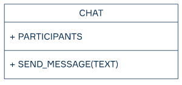
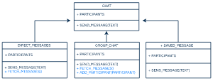

## Inheritance

### What is inheritance?
We start making our program with basic objects and methods. Imagine a messenger application. The main objects in messengers are chats, so we start ours with the CHAT class. Then, we decide to break it into three categories:

* direct messages;
* group chat;
* saved messages only for yourself.

If we want to make more types of chats, do we need to write the code from scratch for each one? The answer is no! With the help of inheritance, we can reuse the code we already have.

Inheritance is a relation between entities that we interpret as "is a" or "is a kind of" relation. In the case of programming methods and attributes, it means that a child entity has every feature of the parent entity. However, we can also change inherited features or define new ones for child classes.

Here are some examples of inheritance:

* A swan is a bird. A swan can do everything that a typical bird can do, but it has an additional feature: it can swim.

* A Python developer is a programmer. They, like all programmers, develop algorithms and computer programs based on special mathematical models, but they do it using a specific language, namely Python.

* A laptop is a computer. It has processor units, memory, keyboard, and all the stuff computers typically have, but it is also portable.

### Inheritance modeling
Let's stick to the example with a chat and see how we can model the classes of our program.

We can start by moving all the shared methods and attributes to the base CHAT class. For the sake of simplicity, we define only one attribute and only one method:



To make our base class more useful, we can add some more features like SEND_FILE, EDIT_MESSAGE, POSTPONE_MESSAGE, and others.
Next, we draw child classes and methods they need to work properly:



Let's take a closer look at the diagram and figure out what benefits inheritance gives us. First, we don't need to implement any other methods to make a new class SAVED_MESSAGE: we add only one participant there, and it can work right out of the box! For the other two classes, we implement only some new methods like FETCH_MESSAGES to get updates from other participants and ADD_PARTICIPANT to add a new person to a group chat.

You may notice that we can even inherit the GROUP_CHAT from the DIRECT_MESSAGES to reuse its methods. It makes sense because there is not much difference if two, three, or a hundred persons communicate in a chat, but the hierarchy is fine, too.

### Open it
Here's how you usually create a class in Kotlin:

`class Book(val pages: Int, val author: String)`
If your code looks like this, you're creating a final class. It means that this class won't be available for inheritance in the future. You just prohibit it. However, don't worry, it's totally OK in Kotlin, as all classes are closed for inheritance by default. As famous software engineer Joshua Bloch once said, "Design and document for inheritance or else prohibit it."

So, if you're really sure that you need to extend your Book class (parent class), here's an easy way to do it:

`open class Book(val pages: Int, val author: String)`
As you can see we just added the open keyword, and now our class is ready for extending. First, let's modify it:

```kotlin
open class Book(val pages: Int, val author: String, var cost: Float = 0F) {
fun getFullInfo(): String {
return "$pages pages, $author author, $$cost cost"
}
}
```
And then extend it:

```kotlin
class Comics(pages: Int, author: String, cost: Float) : Book(pages, author, cost)
```
As you can see, we've created a new Comics class (child class) as an extension of our Book class. We haven't added any additional logic here yet, we've just passed all of its parameters right into the Book main constructor. Let's try it on a real example:

```kotlin
fun main() {
val spidermanBook = Comics(60, "The Universe", 8.99F)
print(spidermanBook.getFullInfo())
}
// output: 60 pages, The Universe author, $8.99 cost
```
What a great comic book we've created!

### Extend it
We can also add more functions to the child classes:

class Booklet(pages: Int, cost: Float) : Book(pages, "", cost) {
```kotlin
fun getUSDCost(): String {
return "$$cost cost"
}

    fun getEuroCost(): String {
        return "€$cost cost"
    }
}
```
And use them:

```kotlin
fun main() {
val centralBooklet = Booklet(5, 0.14F)
print(centralBooklet.getUSDCost())
}
// output: $0.14 cost
```

### Reuse it
You can do even more with the child classes. Let's create a function which defines whether your book is long enough:

```kotlin
fun isBigBook(book: Book): Boolean {
    return book.pages >= 100
}
```
Note that you can use this function for both parent and child classes:
```kotlin
fun main() {
val spidermanBook = Comics(113, "The Universe", 8.99F)
val centralBooklet = Booklet(5, 0.14F)
println(isBigBook(spidermanBook))
println(isBigBook(centralBooklet))
}
// output: true false

```
As you can see, inheritance has a powerful mechanism. We can pass any child of the Book instance to the isBigBook() function.

## OVERRIDING

### Override it
Of course, we need a good example of a class. Let's create the Transport class with its cost property:

```kotlin
open class Transport(val cost: Int) {
fun getFullInfo(): String {
return "$$cost cost"
}
}
```
Pretty typical class ready for extending, right? Keep in mind that it's open. But now we're going to mark our getFullInfo() function as open too and add one more function without the open modifier:

```kotlin
open class Transport(val cost: Int) {
open fun getFullInfo(): String {
return "$$cost cost"
}

    fun getTax(): String {
        return "$${(cost * 0.25).roundToInt()} tax"
    }
}
```
Now we are ready to extend the Transport class with its own getFullInfo() function:
```kotlin
open class Ship(cost: Int, val color: String) : Transport(cost) {
override fun getFullInfo(): String {
return super.getFullInfo() + ", $color color"
}
}

```
By default any overridden function in Kotlin is open. It means that you can override functions in sub-child classes too. Also, if you want to call a parent function, you can use super, as we did it in the example above. Two more things:

If you forget about override keyword, the compiler will warn you because there cannot be two functions getFullInfo() with the same parameters.
You also cannot override the getTax() function because it's not open.
In both cases, the source code wouldn't compile at all. Let's check our freshly created classes in the next example:
```kotlin
fun main() {
val transport = Transport(1000)
val ship = Ship(2000, "marine")
println(transport.getFullInfo())
println(ship.getFullInfo())
}

```
The output should be the following:

```kotlin
//$1000 cost
//$2000 cost, marine color
```
### Reuse it
There is one more useful feature regarding open functions. We will observe it through the following function:

```kotlin
fun getTransportInfo(transport: Transport): String {
return "transport info: " + transport.getFullInfo()
}
```
As you can see it handles the Transport class. What is more, it can process easily any child of this class too:

```kotlin
fun main() {
val transport = Transport(1000)
val ship = Ship(2000, "marine")
println(getTransportInfo(transport))
println(getTransportInfo(ship))
}
```
And it outputs this:

```kotlin
//transport info: $1000 cost
//      transport info: $2000 cost, marine color
```
Voila! The getTransportInfo() function works well with any open function of the Transport class and its child. Behold the real virtual power of Kotlin inheritance!