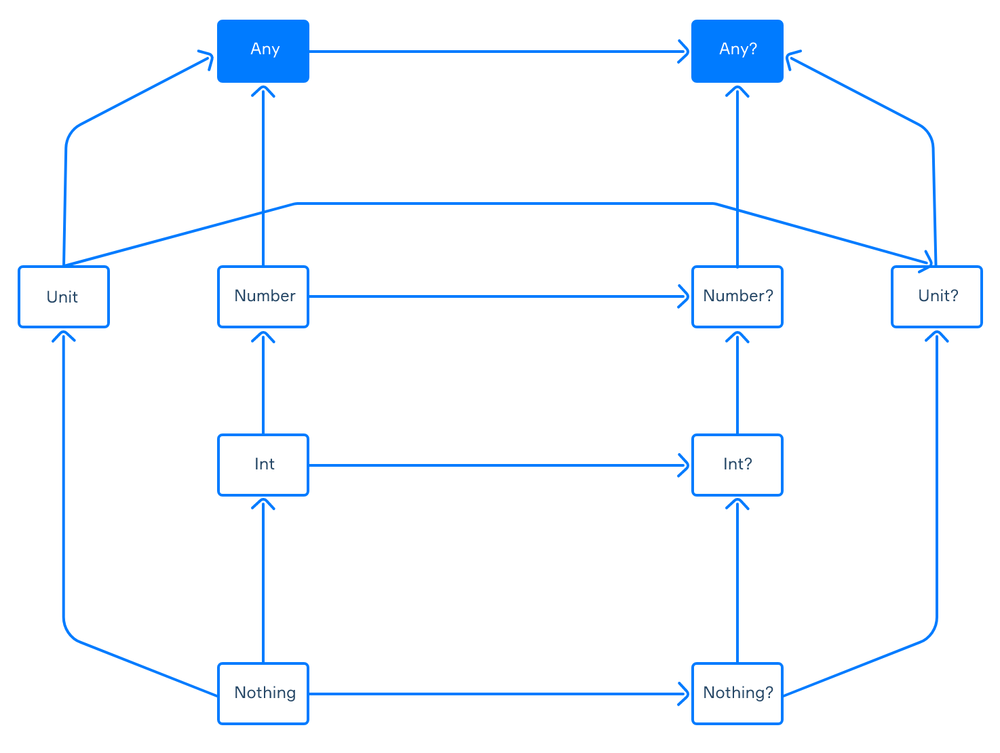
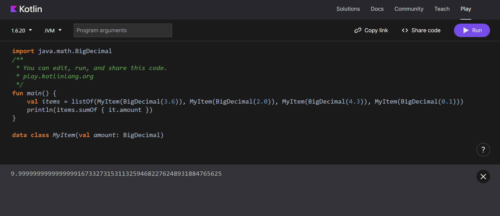

## Stack and Heap Memory
Random Access Memory (RAM) is one of the most integral parts of a computer. This memory is used to store data that needs to be accessed quickly and temporarily by the CPU. The RAM is managed by the operating system. The operating system also makes sure that each process has enough memory and accesses only what they are allowed to access. When programs are executed, data is stored across different parts of the memory, namely the stack and the heap memory.

### Stack memory

Memory allocation takes place in the function call stack, which we refer to as stack memory allocation. The memory space is allocated in contiguous blocks. The compiler is aware of the size of memory that needs to be allocated. Whenever a function is called, memory is allocated for its variables on the stack. The memory for the variables is also released once the function call is finished.

Several factors determine a call stack's size. Typically, it is specified at the beginning of a program. The architecture of the computer on which the program runs, the language used to write the program, and the overall amount of memory available in the system can all affect how big the program is. When a program demands more memory than allocated, it will lead to stack overflow. The program or computer might crash in this situation.

### Heap memory
Heap memory allocation occurs during program execution. Unlike the stack, heap memory is dynamically allocated. Allocation and deallocation are handled by the programmer or the garbage collector. Garbage collectors automatically free up memory that is no longer referenced or used by the program. Not freeing unused variables in the memory might lead to memory leakage. Memory leaks reduce the performance of the program by holding space that would otherwise be free for other parts of the program.

Heap memory is global. It can be accessed and modified within the program by its reference. Unlike the stack, it is not limited to the function where it is allocated. This makes heap memory allocation flexible but not thread-safe as anyone with the reference can read and write to the data.

Heap memory allocation is significantly slower than stack memory allocation and causes memory fragmentation, since the allocation is not contiguous. But it provides dynamic memory allocation which is very helpful in many programs because it allows resizing after program execution.

### Stack vs heap
Both stack and heap memory have their advantages and disadvantages. 
Luckily once you know the tradeoff you can take advantage of them. 
Stack has high access speed and the space is managed by the operating system. 
Whereas heap is slow and is managed by the garbage collector or the programmer. 
Another key difference is that stack stores local variables while heap has the ability to store global variables.

Memory allocation in the stack is contiguous and fixed at compile time and you can not resize once the program starts. The main issue here is running out of space and being constrained. But in the heap memory, size is not fixed. Dynamic allocation gives you the flexibility to resize after the program starts. But the limitation here is that dynamic allocation leads to memory fragmentation.

### The heap
The heap space is a special section of memory located in Random Access Memory, where the application stores objects created during the execution. It is closely related to stack since objects are referred from the heap using variables from the stack that store a reference to the object.

Let's see an example of how it works. Take a look at the following code: Object obj = new Object(). In the left part, we declared a variable of type Object that is stored in the stack. In the right part, two operations are performed. First, the new operator dynamically allocates memory space for the object which will be created and attached to the appropriate variable in the stack. Then the constructor initializes the object, that is, it assigns initial values to the object fields.
Speaking of dynamic memory allocation, it is important to understand that the developer doesn't have to think about when and how much memory to allocate for an object. This is done automatically when the application is executed.

If we assume that in our example the object was created at the address 0x001, then we will have this structure inside the memory:

Note that each object doesn't need to be directly associated with a variable from the stack. We'll talk about it in detail in the next section.

### Heap structure
The heap area is created when the program starts. In the heap, objects are created and deleted automatically. Unlike a stack, where data is stored sequentially, an object inside a heap can be single or reference other objects.
In the previous section, we mentioned that an object is not always directly connected to a stack variable. Here is an example of a situation where you will see the internal structure of the heap:

In the image above, only object 0x001 is associated with the obj_1 variable. The other objects are connected to it via object 0x001. On the other hand, object 0x005 was associated with the variable obj_2, but at some point in the execution of the program, their relationship was removed. Now this object is unused and available for deletion by the JVM.
Before Java 8, a heap space had a special separate section called a Permanent Generation (PermGen) which stored loaded class metadata, String Pool objects (up to the seventh version of Java), and some other stuff. Since Java 8 it has been replaced by the Metaspace which isn't part of a heap and, unlike the PermGen, can increase its size automatically.

### Heap settings
Of course, memory management in Java or Kotlin is done automatically, but the HotSpot JVM provides us with some settings for heap management. Here are just a few of them:

+ Xms for setting the initial heap size when the JVM starts. The full structure for this command is -Xms+size. For instance, if you want to set it equal to 10MB the full command is -Xms10m or -Xms10240k.

+ Xmx for setting the maximum heap size. It is configured in the same way as the previous command. If you want to set it to 1GB the full command is -Xmx1g or -Xmx1024m.

+ XX:PermSize for setting the initial size of the Permanent Generation. The full command for setting this option equal to 10MB looks like this: -XX:PermSize=10m or -XX:PermSize=10240k.

+ XX:MaxPermSize for setting the maximum size of the Permanent Generation. If you want to set it to 1GB the full command will be -XX:MaxPermSize=1g or if you use megabytes unit it will be -XX:MaxPermSize=1024m.

It is preferable to limit the maximum size of the heap. This will help reduce the impact of memory leaks on other processes in the operating system. Otherwise, the OS memory may be overused due to the work of your application and other processes will also lack memory.
Memory leaks occur when, due to incorrect memory management, unnecessary objects aren't deleted or become unreachable for some reason. In such situations, the memory allocated for the application is consumed faster. When the heap runs out of free memory and there isn't enough space to allocate new objects, the application will throw the OutOfMemoryError.

In this section, we mentioned just a few basic settings you can use to manage the heap size in your application. JVM has dozens of them, each providing a specific setting option for other purposes.