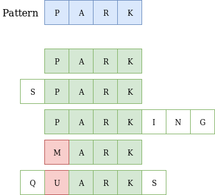
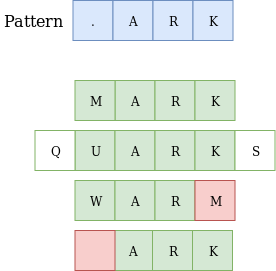

## REGEX or Regular expressions
Manipulating text data is quite a popular task in programming as well as in real life. For example, we often may need to analyze a text, find all specific strings in a file, and so on. Processing text data can be quite a challenging problem. That's why there is a special tool called regular expressions that makes it easier and faster.

###Why regular expressions?
A regular expression (regex or regexp for short) is a sequence of characters that describes a common pattern for a set of strings. Such patterns can be used to search, edit, and manipulate texts. They can either check if a whole string or its substring matches the given pattern or replace the substring with another one.

When do we need such patterns? Say we want to obtain all the files with the same extension (like *.pdf), or extract all the entries of a particular name in different forms (for example, Edgar Poe, Edgar Allan Poe, E. A. Poe, etc.), all email addresses, or even find all numeric structures denoting dates (02/03/2020). With regexps, such tasks can be done with one line.

How do such patterns look? Well, at first, they may seem confusing, look, for example, at \d+(\.\d)? or [a-zA-Z]. And they're often substantially longer. We'll start with the basics, though.

Regexps may be regarded as a kind of sublanguage that most programming languages support, but there are some differences in syntax called "flavors". In this topic, we will consider regexps in isolation from programming languages to understand the general idea.

While learning this topic, you can visit the regexp site to play around with regular expressions from our examples. Choose PCRE as the flavor. It means Perl Compatible Regular Expressions which are the most common standard in practice.

### Matching on examples: more PARKs
Let's start by exploring how matching works formally. Although a regex pattern can be quite a complicated expression containing characters with special meaning, the simplest regex is just a string of simple characters. Suppose, there is a set of words: PARK, SPARK, PARKING, MARK, QUARKS. You need to check which of them contain the word PARK. This is what happens, for example, when you perform a Ctrl+F search on a web page.

We can easily solve this problem using the PARK pattern. The pattern means that symbols P, A, R, K in a word must follow each other from the left end to the right in a word. We suppose that the whole word matches the pattern if any part (substring) of the word matches it.

Here are some explanations: 

the word PARK exactly matches our pattern;
the word SPARK matches our pattern because it has a suitable substring;
the word PARKING matches our pattern due to the same reason;
the word MARK doesn't match our pattern because of the letter M;
the word QUARKS doesn't match our pattern since it does not have a suitable part.
To sum up, only three words match the PARK pattern.

_**In regular expressions, the case of characters is relevant: park is not the same as PARK, i.e., they do not match.**_

In addition, let's consider another sequence of characters PAKR. It does not match our pattern since two characters have a wrong (reverse) order.

###The power of regular expressions
Finding substrings is not very impressive, though. The real power of regular expressions comes when you start using special metacharacters called wildcards. They allow you to define a pattern, so you can match strings that do not necessarily contain an identical sequence of characters. You can skip some characters in a string or match different characters in the same positions, or even repeat a character several times.

Let's introduce two simplest wildcards: dot and question mark.

###The dot character
The dot character . matches any single character including letters, digits, and so on, except for the newline character, unless it is specified.

Let's look at our previous example again with several additional words.

As you remember, in the previous example, two words did not match the pattern because of one unsuitable character. Let's consider them and also add two additional words. Here is our new pattern .ARK with the dot character. It says: "there is any character followed by ARK".

Hooray, both words MARK and QUARKS match the new pattern! But the WARM word does not. Think for a minute, how can this be fixed?

The answer is to use the .AR. pattern, which is matched by WARM, CLARA, PART, and so on.\

The word ARK also does not match our pattern, since it does not have a character in the . position in the pattern, while it is required.

###The question mark

The question mark ? is a special character that means “the preceding character or nothing". The question mark ? signals that the character before it can occur once or zero times in a string to match the pattern. When can we use it?

Maybe with this example, you will finally begin to feel the magic of regexps. Consider the difference between British and American spelling. Imagine, we are trying to find all the studies mentioning color blindness in some publications archive. However, it contains different sources and their spelling may vary. What word should we look for? The answer is both!

The pattern colou?r will match the strings colour and color, but not the string coloor. It is also possible to include the possibility of different letter cases to match the uppercase "Color" as well. We will learn how it is done in later topics.

Let's return to our previous example. The word ARK does not match the .ARK pattern. But if we add ? right after the dot character .?ARK, the word ARK will match the new pattern since the first character is optional now.

Note how we combine the powers of the different wildcards in the combination .?. It is an underlying idea of regexps as well.